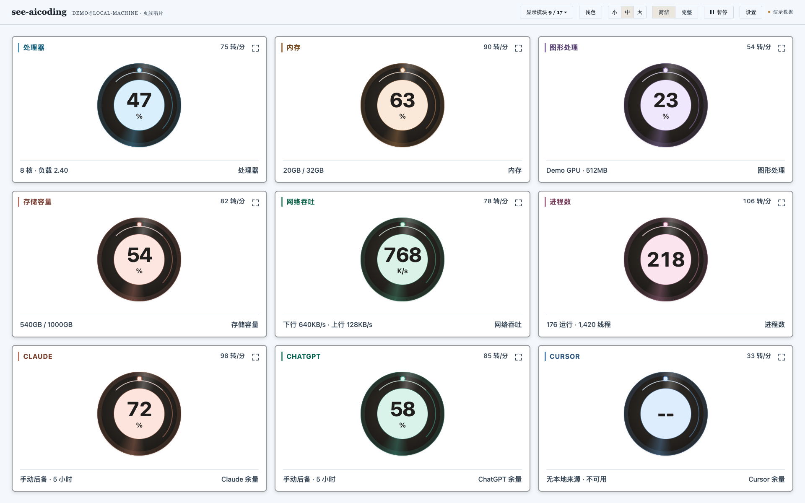
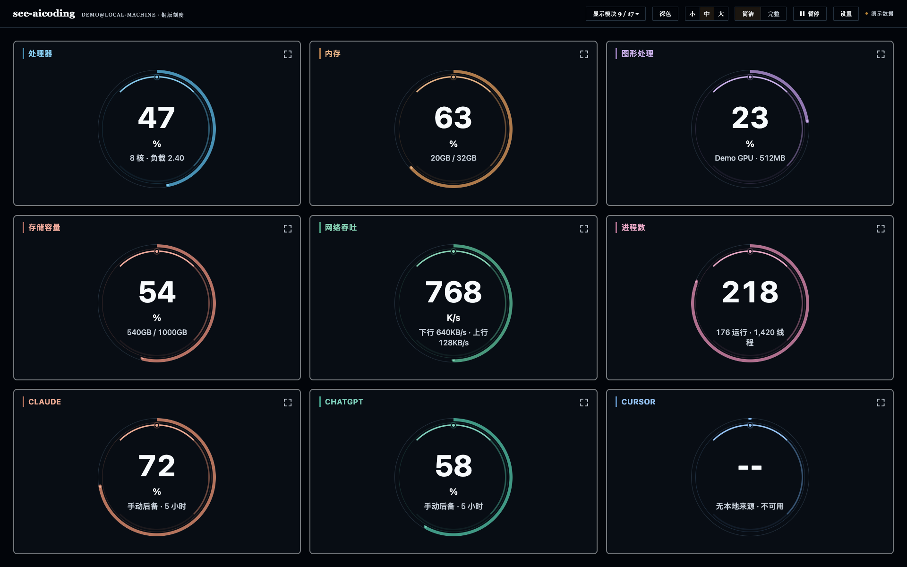

# see-aicoding

<div align="center">

**One local dashboard for system resources and AI coding activity.**

Track CPU, GPU, memory, disks, network, processes, and AI coding workloads in a full dashboard or three animated record-inspired simple views. Choose from 17 modules, switch between Chinese and English, and expand a live card to fill the window. A focused terminal view and a one-click macOS launcher are also available.

本地系统资源与 AI 编程看板：完整视图、三种唱片式简洁视图、17 个可选模块、中英文同步、卡片全屏和 macOS 一键启动。

`pip install --user git+https://github.com/jinlong17/see-aicoding.git`

[](https://www.python.org/)
[](#usage)
[](#install)

</div>

Published version: `0.4.0`. The simple-dashboard and launcher changes on `main`
are documented under **Unreleased** in [CHANGELOG.md](./CHANGELOG.md); they are
not a new tagged release.

[中文使用指南](./docs/USER_GUIDE.zh-CN.md) · [Installation](./INSTALL.md) ·
[Simple mode controls](#simple-mode-quick-start) ·
[Design system](./docs/DASHBOARD_DESIGN_SYSTEM.md)

## Preview

### Web dashboard

These images render the current UI with synthetic demo metrics. They contain no
real host identity, process data, or account usage; availability on your machine
depends on its local providers.

**Tonearm editorial / 唱臂与刊头** — a rotating record beside the live reading.


<details>
<summary>Vinyl record / 虫胶唱片 and Engraved scale / 铜版刻度</summary>





</details>

### Terminal view

```text
╭─ see-aicoding ─────────────────────────────────────────────────────────────╮
│ Time 12:34:56   Network download 80K/s   upload 31K/s                    │
│                         AI active 8 sessions   96 processes              │
│                                             lijinlong@MacBook  macOS 26.4 │
│ AI processor ▰▰▱▱▱▱▱▱▱▱ 21% capacity (172% total)   AI memory ▰▰▰▱▱ 3.1G │
│ Trend ▂▃▄▅▆▇█▇▆▅▄▃▂▁▁    AI memory total 3.1G   processor share 21%       │
│                                             System processor ▰▰▰▱ 37%     │
│                                             System memory 13G/16G 84%     │
│                                             Local storage 436G/460G       │
╰─────────────────────────────── AI workload with system context ───────────╯
╭─ ◆ Claude ─────────────╮╭─ ◆ ChatGPT ───────────╮╭─ ◆ Cursor IDE ──────────╮
│ Processor   14 sessions││ Processor  6 sessions││ Processor    2 sessions│
│ ███░ 26% capacity    ││ ███████░ 94% capacity││ █████░ 52% capacity  │
│ Memory 817.6MB         ││ Memory 1.3GB          ││ Memory 1.1GB            │
│ Projects               ││ Projects              ││ Projects                │
│   ◆ Any2K        9p    ││   ◆ see-aicoding 8p   ││   ◆ Any2K        42p    │
│   ◆ XAI_Desktop  5p    ││   ◆ XAI_Desktop 4p    ││   ◆ XAI_Desktop  10p    │
╰────────────────────────╯╰──────────────────────╯╰────────────────────────╯
╭─ Current-user resource watch ──────────────────────────────────────────────╮
│ ● Memory Top5  RSS  CPU            ● CPU capacity Top5  CAP  MEM         │
│ #1  Claude        ━━━━━━━ 1.8G  5.1%  #1  Codex       ━━━━━━━ 26% 740M   │
│ #2  Google Chrome ━━━━━── 1.1G  1.0% 14p 3 windows / 48 tabs             │
╰──────────────────────── CPU cap = process CPU / logical cores ────────────╯
```

## Why Use It

When a machine feels slow, the responsible workload is often hidden behind helpers, background services, extension hosts, or child processes. `see-aicoding` now provides a system-first Web view and a focused AI terminal view so you can quickly answer:

| Question | Where to look |
|---|---|
| Which AI tool is using the most processor time? | Zone totals and `CPU%` rows |
| Which project is active? | `Projects` rows in each zone and session |
| Is the activity from a root process or helper? | Tree rows under each session |
| Is a session actually doing work? | `Status`: `HOT`, `LIVE`, `WARM`, or `IDLE` |
| Which AI extensions are installed? | Cursor zone extension inventory |
| Is the whole machine under pressure? | Top-right system processor, memory, storage, and network rows |
| Which current-user apps or process groups are hottest? | Bottom resource watch: Memory Top5 and CPU capacity Top5 |
| Is pressure coming from CPU, GPU, memory, or storage? | Web overview resource cards and live history |
| Which programs and individual PIDs are responsible? | Web Programs / Processes inventory |
| How much disk space remains on each local volume? | Web Storage section |
| Did a resource cross a limit, and when did it recover? | Web event timeline and SQLite history |
| Which service, process, or container owns the activity? | Process tree and Web Runtime section |
| Which process is sending or receiving data? | Runtime per-process network attribution |

## Features

| Area | What you get |
|---|---|
| AI process grouping | Claude Code, Claude Desktop, ChatGPT/Codex, Cursor, ChatGPT extensions, and common helper processes |
| Project attribution | Project names inferred from cwd, repo markers, and Cursor extension-host process names |
| Stable ordering | Sessions sort by creation time, so rows do not jump around when CPU changes |
| Per-project totals | Process count, processor usage, and memory per detected project |
| System context | Time, network throughput, system processor, system memory, and local storage |
| Resource watch | Current-user app/process-group Memory Top5 by summed RSS and CPU Top5 normalized to whole-machine capacity, with Chrome tab counts on macOS when permitted |
| Extension inventory | Installed Cursor / VS Code AI extensions with version and host |
| System resource center | Live CPU, GPU, memory, swap, storage, disk I/O, network, sensors, and short histories |
| Full process inventory | System-readable programs and PIDs with search, filtering, sorting, and details |
| Process tree and services | PID/PPID hierarchy plus cached launchd or systemd service inventory |
| Thresholds and events | Editable warning/critical thresholds with hysteresis, active alerts, and transition-only timeline |
| Persistent history | SQLite WAL storage, 7-day retention, and downsampled 15m / 1h / 6h / 24h / 7d queries |
| Storage health | Per-device throughput, IOPS, average latency, and SMART/NVMe health via diskutil or smartctl |
| Network attribution | macOS per-process byte rates via nettop; connection and endpoint fallback where byte counters are unavailable |
| Container runtime | Docker/Podman inventory and one-shot CPU, memory, network, block I/O, port, and PID metrics |
| Guarded process actions | Suspend, resume, or terminate current-user processes with protected PID and same-origin checks |
| Compact Dashboard | Full and simple Web views with three record styles, 17 selectable live cards (including AI capacity), animated records, balanced responsive layouts, S/M/L card sizing, five synchronized themes, and SQLite-backed preferences |
| Card interactions | Hover emphasis, single-click detail flip, double-click/full-window focus, keyboard controls, and a persistent module dropdown with System/AI presets |
| Bilingual interface | Shared English/Simplified Chinese preference across all three simple styles, labels, controls, and supported status messages |
| macOS desktop launcher | Generate a Finder/Dock app once; subsequent clicks reuse or start the local background server without Terminal |
| AI quota cards | Automatic local ChatGPT/Codex and explicitly enabled Claude quota updates, with manual fallback and truthful Cursor unavailable states |
| Workload storage | Staggered, cached project-directory allocation for each attributed AI workload |
| CPU temperature | Best-effort CPU package temperature with explicit platform/provider availability |
| Stable semantic colors | Dedicated colors for resources, I/O directions, runtime domains, alert states, and each AI provider |

## Install

Install from GitHub:

```bash
python3 -m pip install --user git+https://github.com/jinlong17/see-aicoding.git
```

Or with `pipx`:

```bash
pipx install git+https://github.com/jinlong17/see-aicoding.git
```

Upgrade an existing install from the latest `main` branch:

```bash
python3 -m pip install --user --upgrade --force-reinstall git+https://github.com/jinlong17/see-aicoding.git
```

For local development:

```bash
git clone https://github.com/jinlong17/see-aicoding.git
cd see-aicoding
python3 -m venv .venv
source .venv/bin/activate
python3 -m pip install --upgrade pip
python3 -m pip install -e .
see-aicoding --web --open
```

If the command is not found after a `pip --user` install, add your Python user-base bin directory to `PATH`:

```bash
python3 -m site --user-base
```

If your `see-aicoding` command is a local wrapper that launches a dedicated
virtualenv, update that virtualenv directly. For example, a wrapper using
`~/.local/share/see-aicoding/venv/bin/see-aicoding` can be upgraded with:

```bash
~/.local/share/see-aicoding/venv/bin/python -m pip install --upgrade --force-reinstall git+https://github.com/jinlong17/see-aicoding.git
```

## Usage

```bash
see-aicoding --web --open     # compact Web dashboard at 127.0.0.1:8765
see-aicoding --web            # Web dashboard without opening a browser
see-aicoding --web -i 0.5     # Web dashboard with faster sampling
see-aicoding                  # focused terminal AI dashboard, 1.5s refresh
see-aicoding -i 0.5           # faster terminal refresh
see-aicoding --all            # include idle sessions
see-aicoding --no-tree        # one row per session
see-aicoding --once           # print one snapshot and exit
see-aicoding --full-screen    # alternate-screen mode
see-aicoding --capture-claude-usage  # Claude status-line capture command
see-aicoding --version        # print the installed version
```

| Flag | Default | Effect |
|---|---:|---|
| `-i / --interval SECS` | `1.5` | Refresh interval, minimum 0.5s |
| `--hide-idle` | on | Hide sessions below 0.5% CPU; kept for compatibility because this is now the default |
| `-a / --all` | off | Show all sessions, including idle sessions |
| `--no-tree` | off | Hide descendant process tree |
| `--once` | off | Render one snapshot and exit |
| `--full-screen` | off | Use terminal alternate screen |
| `--web` | off | Run the localhost web monitor instead of the terminal dashboard |
| `--open` | off | Open the web monitor in the default browser; only applies with `--web` |
| `--host HOST` | `127.0.0.1` | Web monitor host; localhost addresses only |
| `--port PORT` | `8765` | Web monitor port |
| `--capture-claude-usage` | off | Read one Claude status-line payload from stdin, persist only sanitized quota fields, print a compact status line, and exit |

## Web Monitor

### One-click macOS launch

After the one-time setup below, double-click **See AI 看板.app** on the Desktop to launch the dashboard.
It starts the server in the background and opens the default browser. Repeated
clicks reuse the existing server; no Terminal window is needed. The app can also
be dragged into the Dock. To create the app on another Mac, run this once from
an environment where see-aicoding's dependencies are installed:

```bash
python3 scripts/install-macos-launcher.py
```

The launcher uses this checkout and Python environment; rerun the installer in
a new destination if either path changes. Startup logs are written to
`~/Library/Logs/see-aicoding/web-8765.log`.
The installer is part of the cloned repository, not a downloaded prebuilt app.
See [launcher setup and troubleshooting](./INSTALL.md#one-click-macos-launcher).

```bash
see-aicoding --web --open
```

The Web monitor serves a local-only system resource center at
`http://127.0.0.1:8765/`. Its compact single-page layout keeps resource cards at
the top and presents AI workloads, trends and alerts, resource leaders, process
inventory, storage health, and runtime data as movable sections instead of
large top-level tabs. The unified Settings panel controls language, five themes,
small/standard/large text sizing, density, full/simple view, the Vinyl Record,
Tonearm Editorial, and Engraved Scale simple styles, S/M/L simple-card sizing,
the same five themes in every view, card visibility, section
visibility, section order, refresh policy, quota fallbacks, and process columns.
Simple mode offers 17 live cards and shows CPU, memory, GPU, storage, network,
processes, Claude, ChatGPT, and Cursor by default. Its animated records use the
same live telemetry as the full dashboard, flip to reveal details, and support
persisted drag or keyboard reordering. Header card, theme, and size controls
apply immediately; Settings changes remain a local draft until **Save** is
clicked. **Reset** prepares the default draft, while
clicking outside the panel or pressing Escape closes it without applying
unsaved changes. Saved preferences persist in SQLite.
The header's **Modules** dropdown supports individual selections and All/System/AI/default
presets with automatic saving. All three simple styles follow the global Chinese/English
setting (product names and technical units remain unchanged). Hover lifts a card;
single-click or Enter/Space flips it, while double-click, the expand button, or **F**
opens a full-window card. Double-click again, press **Esc**, or use the exit button
to return to its original position. Other records pause while one is expanded.
Simple mode balances the last row and fits card height to the available viewport,
including small cards and reduced module selections.
Its dedicated stream omits session/process trees, skips hidden charts and detail
rendering, and releases full-view DOM and process arrays when switching views.
Offscreen, flipped, and background-tab records pause their animations.
Apple Silicon, NVIDIA, Linux DRM, SMART, launchd/systemd, nettop, Docker, and
Podman providers are detected at runtime and expose explicit unavailable states.
Process details are loaded on demand; current-user suspend, resume, and
terminate actions are protected by same-origin checks, PID guards, and an
in-product confirmation step.

The color system is intentionally semantic: CPU, GPU, memory, storage, network,
processes, disk I/O, services, containers, and alert states each have a
dedicated token. Claude, ChatGPT, and Cursor keep stable identity colors across
their cards, trends, projects, sessions, and child-process rows.

### Simple mode quick start

1. Click **Simple** in the header. In **Settings**, choose **Simple style**:
   Vinyl record, Tonearm editorial, or Engraved scale, then click **Save**.
2. Open **Modules ▾** to show only the cards you need. All/System/AI/default
   presets and individual checkboxes save immediately; at least one card stays
   visible. Module choices are shared by the three simple styles.
3. Use **S / M / L** in the header to change card layout. This is separate from
   **Text size** in Settings. Small mode balances rows using the available space.
4. Set **Language** and **Theme** in Settings and **Save**. All three styles use
   the same global language and five themes; brand names and units stay intact.

| Action | Mouse / keyboard |
| --- | --- |
| Emphasize a card | Hover (motion is reduced when requested by the OS/browser) |
| Show details / return to the front | Single-click the card, or Enter / Space while the card itself is focused |
| Expand / restore a live card | Double-click the card, or press F while it is focused |
| Open full-window focus | Click the expand icon at the top-right of the card |
| Exit full-window focus | Double-click, F, Esc, or the exit button |
| Reorder cards | Drag, or Alt + Left / Right while a card is focused |
| Pause / resume updates and record motion | Header Pause / Resume button |
| Inspect processes and other detailed sections | Switch back to Full |

Full-window focus fills the browser content area, not the browser's operating-system
fullscreen mode. It keeps the same live card and restores its original position
and face when closed. The other cards' animations pause while it is open.

Default modules: CPU, memory, GPU, storage, network, processes, Claude, ChatGPT,
and Cursor. Also available: disk read/write, IOPS, I/O latency, download/upload,
system services, and containers. AI cards show **remaining quota**, not CPU
usage; unavailable values remain `--`, and stale values retain their status.
Hiding an individual AI module is not the same as disabling quota collection;
the global quota-visibility setting controls automatic provider refreshes.

### Lightweight refresh and performance

The live path builds the compact SSE model directly. It does not first build
and then discard the complete process and application inventories. A full
schema-v3 snapshot is materialized once per sampling window only when the
process section is near the viewport or an API client requests
`/api/snapshot`. Stable process metadata is cached for 30 seconds; thread count,
status, and accumulated CPU time use a 5-second cache. CPU percentage, resident
memory, disk/network rates, hardware telemetry, and AI workload totals continue
to follow the selected live refresh interval.

Refresh modes control both SSE and full process detail:

| Mode | Compact SSE | Full process detail while visible |
| --- | ---: | ---: |
| Realtime | 1.5 s | 4.5 s |
| Balanced | 3 s | 9 s |
| Efficient | 5 s | 15 s |

Background runtime collectors run only while their section and browser tab are
active. Hiding quota cards pauses future provider collection. Compact events
and unchanged process tables use difference signatures to avoid repeated DOM
replacement; Chinese localization is scoped to sections that actually changed
instead of rescanning the whole document. Efficient mode also disables
decorative meter and loading animations. The page uses SVG/DOM charts and does
not create a WebGL or canvas renderer, so the dashboard itself does not reserve
a separate GPU rendering workload.

On a development 10-core macOS host with roughly 687 readable processes, the
same forced compact-refresh profile fell from 73.46 ms to 41.02 ms per cycle
(44.2%); the compact event was about 31 KiB versus 438 KiB for the full snapshot
(7.1%). This is a representative engineering measurement, not a hardware SLA;
actual cost scales with process count and enabled platform providers.

### Automatic AI quota updates

Quota collection runs independently from the resource sampling loop. Results
are cached for 5 minutes; failures use bounded exponential retry from 30 seconds
to 10 minutes, each local provider request times out after 8 seconds, and the
Refresh quotas action has a 10-second cooldown. The dashboard API always returns
the current safe cache immediately, so quota collection cannot delay CPU,
memory, GPU, disk, or process snapshots. A transient refresh failure preserves
the last successful values with an explicit stale state.

The compact quota cards use two circular gauges per service for the 5-hour and
weekly windows. A full ring and `100%` mean all quota remains; the center value
is remaining capacity, while used capacity stays available as secondary text.
Manual Settings inputs also accept **remaining percentages** and are translated
to the internal used-percentage schema for backward compatibility. Use
**Hide quotas / Show quotas** in AI Workloads, or the persistent quota switch
in Settings. Hiding the cards also pauses future automatic collection; showing
them resumes the collector and requests a fresh cached result. No separate
quota daemon or startup command is required: `see-aicoding --web` owns the
lightweight collector.

- **ChatGPT:** the dashboard automatically prefers the Codex binary bundled
  with ChatGPT.app/Codex.app, validates the app-server protocol by making the
  real local request, and falls back across compatible local candidates. This
  avoids an older NVM/global CLI shadowing the supported app binary. An
  explicit `SEE_AICODING_CODEX_BIN` remains available as an override. The
  collector reads `account/rateLimits/read` for the currently active Codex
  profile and does not inspect or copy credentials, cookies, or account files.
- **Claude:** Claude Code can be explicitly configured to send its official
  status-line JSON to the capture command below. Every status-line run is
  recorded, even one that carries no `rate_limits`, so the dashboard can tell
  "the command has never run" apart from "the account never reports quota".
  When no quota has been captured, the collector also runs the local
  `claude auth status --json` command and retains only the subscription type in
  a 15-minute memory cache, purely to name the plan in the status text;
  `SEE_AICODING_CLAUDE_BIN` can override CLI discovery when needed. The capture
  file contains only `five_hour` / `seven_day` usage percentages, reset
  timestamps, capture time, and run counters; it is written atomically with
  user-only permissions. Heartbeat and identical status-line values are written
  at most once per minute to limit disk churn.
- **Cursor:** no supported personal quota source is assumed. Cursor remains
  unavailable unless manual percentages are entered in Settings; no browser
  scraping, cookie access, or private API is used.

To enable Claude automatic updates, add this explicit status-line command to
`~/.claude/settings.json`. Prefer the absolute installed path so Claude Code
does not depend on its inherited PATH:

```json
{
  "statusLine": {
    "type": "command",
    "command": "/opt/anaconda3/bin/see-aicoding --capture-claude-usage"
  }
}
```

Claude Code fills `rate_limits` from API response headers, so the field is
absent until the first response of a session and stays absent for API-key,
Bedrock, and Vertex sessions. Only Claude Code itself runs this command:
**Claude Desktop does not execute Claude Code `statusLine`**, so a desktop-only
setup never produces a snapshot. The dashboard reports the three cases
separately:

| Claude card | Meaning |
| --- | --- |
| **CLI not run** | The command is configured but has never been invoked. Run `claude` in a terminal. |
| **Waiting** | The status line ran, but no API response with quota has arrived yet. |
| **Manual only** | Repeated responses returned no `rate_limits`, so this account does not publish quota. |

The **Manual only** verdict is reached from observed responses, never from the
plan name alone; the subscription type is read only to name the plan in the
status text. That auth status check runs on the independent quota worker, has a
3-second timeout, is cached for 15 minutes, and neither returns nor persists
credentials. A missing field does not erase the last good local snapshot.
Automatic values take precedence; Settings values fill only quota windows that
the automatic source did not return. Those manual fields are entered as
remaining capacity, matching the gauge direction.

See [the resource dashboard architecture](https://github.com/jinlong17/see-aicoding/blob/main/docs/RESOURCE_DASHBOARD_ARCHITECTURE.md)
for the research basis, module boundaries, GPU availability contract, and
recommended next phases. See [the dashboard design system](https://github.com/jinlong17/see-aicoding/blob/main/docs/DASHBOARD_DESIGN_SYSTEM.md)
for the palette registry, component color rules, density contract, and visual QA checklist.

## Troubleshooting

Check which executable your shell is running:

```bash
which see-aicoding
see-aicoding --version
```

Check whether the loaded package is the expected release and exposes the Web command:

```bash
see-aicoding --version
see-aicoding --help
python3 -c "import see_aicoding; print(see_aicoding.__version__, see_aicoding.__file__)"
```

With the Web monitor running, verify the live API and saved dashboard preferences:

```bash
curl --fail --silent http://127.0.0.1:8765/api/snapshot | python3 -m json.tool | head -40
curl --fail --silent http://127.0.0.1:8765/api/dashboard-preferences | python3 -m json.tool
curl --fail --silent http://127.0.0.1:8765/api/provider-usage | python3 -m json.tool
curl --fail --silent 'http://127.0.0.1:8765/api/provider-usage?refresh=1' | python3 -m json.tool
```

If `which see-aicoding` points to a wrapper script, inspect the first few lines
of that wrapper and upgrade the Python environment named there:

```bash
head -20 "$(which see-aicoding)"
```

If the bottom Resource watch is missing or Chrome tab details are not visible,
try a one-shot render with enough terminal space:

```bash
COLUMNS=170 LINES=40 see-aicoding --once --no-tree
```

Compact terminals keep the Resource watch panel but hide extra details such as
Chrome window/tab counts. Chrome counts also require macOS permission for the
terminal to query Google Chrome through AppleScript; if permission is denied,
the dashboard silently falls back to process counts.

## Detection

| Tool family | Detection signal |
|---|---|
| Claude Code CLI | `~/.local/share/claude/versions/`, `@anthropic-ai/claude-code` |
| Claude Desktop | `/Applications/Claude.app/` and helper process tree |
| Claude in Cursor / VS Code | `anthropic.claude-code-*` extension paths |
| Codex Desktop | `/Applications/Codex.app/` and helper process tree |
| Codex CLI | `@openai/codex`, `~/.codex/`, `codex` executable paths |
| ChatGPT extensions | `openai.chatgpt-*`, `openai.codex-*` |
| Cursor IDE | `/Applications/Cursor.app/` |
| Other AI extensions | Copilot, Cline, Continue, Cody, Tabnine, Codeium |

## Project Labels

Each session tries to show the project directory instead of only the app name.

For CLI tools, the label usually comes from the root process cwd. For desktop shells such as Codex Desktop and Cursor, `see-aicoding` also looks through child process cwd values and Cursor extension-host process names. If multiple projects belong to one desktop app tree, the session row is shown as `N projects`, with colored project rows underneath. Zone headers show one project per line with process count, CPU, and memory.

Child processes are grouped under their detected project when the cwd or Cursor extension-host command exposes one. In a single-project session, helper processes without their own project signal are folded into that project. In a multi-project desktop session, unassigned helpers stay under `helpers` instead of being guessed into the wrong project.

Ignored locations include app bundles, system directories, temporary directories, and extension/plugin cache folders.

## Stable Rows

Rows are sorted by creation time, newest first. CPU changes do not reshuffle rows.

Idle sessions are hidden by default, so the top header shows `AI active` and each zone's session, process, processor, memory, and project totals are calculated from visible active sessions only. Use `--all` when you want to inspect every still-running helper or idle session. Rows remain sorted by creation time, newest first; CPU changes do not reshuffle rows.

## Architecture

```text
src/see_aicoding/
├── cli.py             # argparse, refresh loop, Live rendering
├── monitor.py         # process sampling, classification, session aggregation
├── render.py          # Rich layout, panels, colors, tables
├── snapshot.py        # JSON snapshots for the web monitor
├── telemetry.py       # system metrics, GPU, disk counters, process actions
├── observability.py   # threshold state machine and transition events
├── persistence.py     # SQLite samples, events, settings, and range queries
├── storage.py         # diskutil/smartctl health adapters
├── runtime.py         # services, per-process network, Docker/Podman adapters
├── usage.py           # cached local provider quotas and Claude status-line capture
├── web.py             # local ThreadingHTTPServer + SSE endpoints
├── web_static/        # compact browser UI, semantic color tokens, and interactions
├── cursor_ext.py      # Cursor / VS Code AI extension scanner
├── __main__.py        # python -m see_aicoding
└── __init__.py
```

Sampling flow:

1. `Sampler.snapshot()` walks the current user's processes for TUI mode and all readable system processes for Web mode.
2. `classify()` tags each process as Claude, ChatGPT/Codex, Cursor, extension, MCP, or child.
3. `build_sessions()` picks root processes and attributes descendants through the parent-process chain.
4. Project names are inferred from cwd, repo markers, and selected desktop app child processes.
5. `render_all()` draws the header, three zones, current-user resource watch, footer, sparklines, and extension inventory.
6. `SystemTelemetry.sample()` adds CPU, GPU, memory, disk, network, sensor, and history data.
7. Threshold transitions and resource samples are written to SQLite with a bounded retention policy.
8. `build_snapshot()` normalizes schema v3, builds the compact cached `/events`
   model directly, and materializes full `/api/snapshot` inventories on demand.
9. Services, long history, process network attribution, containers, and selected process details use separate on-demand endpoints.
10. Provider quotas refresh on an independent cached worker and merge with manual values outside the resource snapshot path.

## Notes

- macOS resident memory includes shared library pages, so Electron/V8 memory can read higher than private working set.
- AI processor capacity is normalized to all CPU cores; the total value is the summed per-process CPU percentage.
- Resource watch groups app helper processes together, sums each group's RSS and CPU percentage, then divides CPU by logical CPU count so it is comparable with the header capacity bars.
- On macOS, Google Chrome rows can append full window and tab counts via AppleScript when the terminal has permission to query Chrome; failures are hidden so monitoring keeps working.
- System memory uses `total - available`, so the displayed size and percentage share the same pressure-oriented basis.
- Whole-machine network speed comes from OS counters. On macOS, nettop also provides per-process byte-rate attribution; other platforms fall back to readable socket ownership and explicitly mark throughput unavailable.
- Pure extension API activity cannot always be separated from the Cursor Extension Host process.
- Network activity is treated as a lightweight live/idle signal; reverse-DNS attribution is intentionally avoided.
