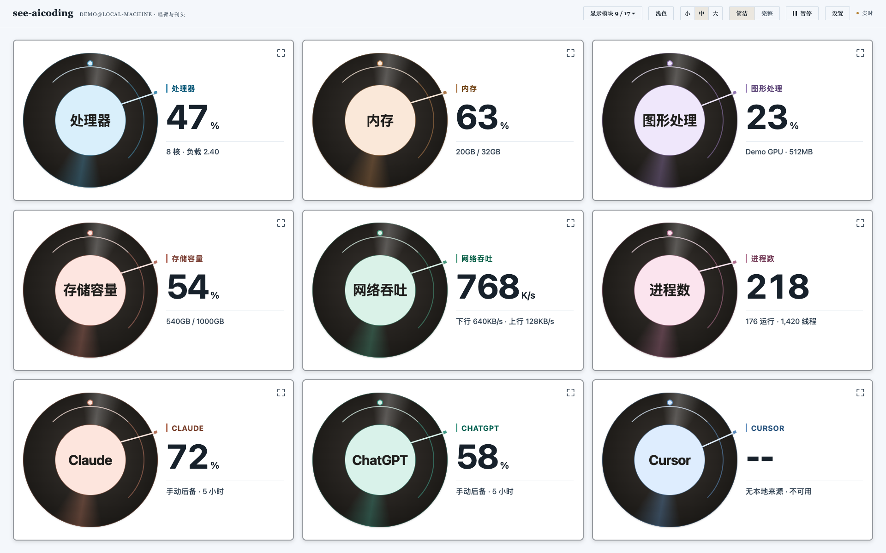

# see-aicoding 中文使用指南

更新日期：2026-09-09。适用于当前 `main` 分支；包版本仍为 `0.4.0`，本轮功能
尚未单独发布版本标签。返回[项目主页](../README.md) · [安装说明](../INSTALL.md) ·
[更新记录](../CHANGELOG.md)。

## 这个看板能做什么

这是运行在本机的系统资源与 AI 编程看板，支持 macOS 和 Linux：

- **完整视图**：查看 CPU、GPU、内存、存储、网络、程序/进程、历史、告警、
  系统服务、容器和 AI 工作负载，按需展开详细信息。
- **简洁视图**：用三种唱片式卡片显示选中的资源和 AI 剩余额度，适合日常常驻。
- **终端视图**：在命令行集中查看 Claude、ChatGPT/Codex 和 Cursor 编程活动。

服务默认只监听 `127.0.0.1:8765`，不向局域网开放。系统读取能力取决于权限和
本机安装的探针；缺失值显示不可用，不用虚构的 `0` 代替。

## 安装与启动

安装当前 GitHub 分支：

```bash
python3 -m pip install --user git+https://github.com/jinlong17/see-aicoding.git
see-aicoding --web --open
```

若系统 Python 不允许用户安装，可用 `pipx`，或按照[安装说明](../INSTALL.md)
创建虚拟环境。网页默认打开 <http://127.0.0.1:8765/>。

```bash
see-aicoding --web                 # 启动网页服务，不自动打开浏览器
see-aicoding --web --port 8877      # 使用另一个本地端口
see-aicoding                       # 终端模式
see-aicoding --once                # 打印一次终端快照后退出
```

### macOS 一键启动

首次在源码目录配置一次，之后不需要手动输入启动命令：

```bash
git clone https://github.com/jinlong17/see-aicoding.git
cd see-aicoding
python3 -m venv .venv
source .venv/bin/activate
python3 -m pip install -e .
python3 scripts/install-macos-launcher.py
```

桌面会生成 **See AI 看板.app**。双击即可打开看板，也可以拖到 Dock。重复点击
会复用已运行的健康服务，不会为每次点击启动一份新看板。

注意：应用绑定此源码目录和 Python 环境，不要随意移动或删除它们。安装器不会
覆盖同名应用；重建时先在 Finder 中移走旧副本，或用 `--destination` 指定新目录。
这不是开机自启功能。关闭浏览器也不会关闭后台服务；如需停止，用“活动监视器”
确认 `see_aicoding.cli --web` 对应的 Python 进程后退出它。不要批量结束所有 Python。

启动失败时查看 `~/Library/Logs/see-aicoding/web-8765.log`。Linux 使用命令行启动，
不使用这个 macOS 桌面应用。

## 先设置语言、主题和样式

1. 点击顶部 **Settings / 设置**。
2. 将 **Language / 语言** 切换为“简体中文”或“English”。
3. 选择浅色、浅黄色、浅绿色、暗色或深色主题，以及文字大小。
4. 点击 **Save / 保存**。
5. 点击顶部 **简洁 / Simple**，在设置的“简洁样式”中选择一种样式并保存。

| 样式 | 特点 |
| --- | --- |
| 虫胶唱片 / Vinyl record | 深色唱片与固定中央读数，带高光、弧线和转动标记 |
| 唱臂与刊头 / Tonearm editorial | 唱片与较大的读数并排；窄屏上下排列，中心显示完整名称 |
| 铜版刻度 / Engraved scale | 外圈表达当前数值，内圈独立转动；数字保持居中、静止 |

三种样式共用全局语言和主题，不需要分别设置。Claude、ChatGPT、Cursor 等品牌名、
设备名和技术单位保留原文；后端返回的未知诊断信息也可能保留原始文本。



以上截图使用演示数据，不代表本机真实用量或账号额度。

## 选择需要显示的模块

点击顶部 **显示模块 ▾ / Modules ▾**，逐项勾选即可；也可使用“全部模块”、
“仅系统”、“仅 AI”、“默认模块”快捷组合。修改立即生效并自动保存，至少保留一张。
刷新页面或重启后会恢复已保存的组合，切换简洁样式不会重置选择。

| 分类 | 可选模块 | 默认显示 |
| --- | --- | --- |
| 核心资源 | 处理器、内存、图形处理、存储容量、网络吞吐、进程数 | 是 |
| 磁盘 I/O | 磁盘读取、磁盘写入、每秒读写、I/O 延迟 | 否 |
| 网络方向 | 下行速率、上行速率 | 否 |
| 系统运行时 | 系统服务、容器 | 否 |
| AI 额度 | Claude、ChatGPT、Cursor | 是 |

共 17 个模块，默认 9 个。“仅系统”包含前四类，共 14 个；“仅 AI”包含最后一类。
选择模块不会自动安装探针。没有 Docker/Podman 等运行环境时，容器卡片会说明原因。

## 大中小、文字大小和排序

- 顶部 **小 / 中 / 大**（英文 **S / M / L**）改变卡片尺寸与排列，立即保存。
- 设置中的**文字大小**独立控制字体，需要点击保存；它不是卡片尺寸开关。
- 小尺寸按视口和模块数量平衡行列，减少底部空白。手机上优先单列，模块较多时
  正常向下滚动，不强行把所有内容缩进一屏。
- 拖动卡片改变顺序；键盘聚焦卡片后，按 **Alt + 左 / 右方向键**也可以移动。
  顺序会自动保存。

## 卡片操作与全屏

| 目的 | 操作 |
| --- | --- |
| 突出当前卡片 | 鼠标悬停，卡片轻微上浮并加强阴影 |
| 查看背面详情 / 返回正面 | 单击卡片；或聚焦卡片本身后按 Enter / 空格 |
| 全屏显示 / 恢复卡片 | 双击卡片；或聚焦卡片后按 F |
| 用按钮全屏显示 | 点击卡片右上角的展开图标 |
| 退出全屏 | 双击、F、Esc，或点击“退出全屏” |
| 暂停 / 继续 | 点击顶部“暂停 / 继续” |
| 查看程序、进程和完整功能 | 切换顶部“完整 / Full” |

这里的“全屏”是**占满浏览器内容区域**，不是操作系统级浏览器全屏。全屏仍是同一张
实时卡片，不是截图；其他卡片的装饰动画暂停，关闭后恢复原位置与原正反面。

操作系统或浏览器开启“减少动态效果”时，旋转与悬停动画会主动减弱或停止。
切换到后台标签页、卡片离开视口、翻到背面或暂停看板，也会停止相应动画。

## 设置什么时候保存

| 入口 | 保存行为 |
| --- | --- |
| 顶部视图、主题、卡片尺寸、显示模块 | 立即应用并保存 |
| 拖动或键盘重排卡片 | 自动保存 |
| 设置弹窗 | 保持草稿，点击“保存”才生效 |
| 设置中的“重置” | 仅准备默认草稿，仍需保存 |
| 点击设置外部或按 Esc | 关闭并丢弃未保存的草稿 |

偏好存储在本地 SQLite。单张卡片的翻面和全屏状态是临时交互，不作为重启后的设置保存。

## AI 数值如何理解

简洁模式 AI 卡片上的百分比是**剩余额度**，不是 CPU 使用率，也不是整个 ChatGPT
账户所有产品的通用配额。数值来自受支持的本地来源；通常优先显示五小时窗口，缺失时
使用每周窗口。背面可查看窗口和来源，状态会注明过期、手动或不可用。

- ChatGPT 卡片读取本地 Codex 活动账号的额度来源。
- Claude 自动采集需要用户显式配置 Claude Code status-line；仅打开 Claude Desktop
  并不会执行该命令。详见[自动额度说明](../README.md#automatic-ai-quota-updates)。
- Cursor 没有假定可用的非公开个人接口；没有受支持来源或手动值时显示 `--`。
- 设置中的手动值填写**剩余百分比**。自动数据优先，手动值只补充缺失窗口。
- 在“显示模块”中隐藏一张 AI 卡片，不等于停止全局额度采集；自动采集由全局额度
  显示设置控制。完整视图中还可查看独立的 AI 工作负载和 CPU/内存活动。

## 减少运行开销

日常可选择“平衡”刷新，需要更低频率时选择“节能”，不必使用更快的采样参数。

| 刷新策略 | 实时事件间隔 | 完整视图可见进程详情间隔 |
| --- | --- | --- |
| 实时 | 1.5 秒 | 4.5 秒 |
| 平衡 | 3 秒 | 9 秒 |
| 节能 | 5 秒 | 15 秒 |

简洁视图使用更小的数据投影，不传输完整进程/会话树；切换到简洁模式后释放完整视图
的重型 DOM 和进程数组。动画不使用逐帧 JavaScript 循环。选择更少模块也减少可见
卡片渲染，但不代表停掉所有底层采样，实际内存与 CPU 占用仍随机器和探针变化。

## 更新与常见问题

源码开发安装可在工作区干净时 `git pull --ff-only`，然后在同一虚拟环境执行
`python3 -m pip install -e .`。其他安装方式见[更新说明](../INSTALL.md#updating)。
更新后需重新启动正在运行的服务器，才能加载后端修改；再刷新网页。
这批功能仍归入 Unreleased，不要只凭 `--version` 判断分支代码是否已经更新。

| 现象 | 检查方式 |
| --- | --- |
| 找不到模块 | 打开“显示模块”，尝试“默认模块”或“全部模块” |
| 切换设置后没有变化 | 确认已点击“保存”；必要时重新加载网页 |
| 动画停止 | 检查暂停、后台标签页和系统“减少动态效果” |
| AI 显示过期或 `--` | 检查来源与采集配置，不要把缺失当作零额度 |
| 启动器失败 | 查看日志、端口占用，以及原 Python/源码路径是否还在 |
| 更新后还是旧界面 | 重启服务并刷新；macOS 可尝试 Cmd+Shift+R |

停止服务、关闭浏览器或卸载软件不会自动清除本地历史与偏好；不要为了排查样式问题
直接删除数据库。更底层的实现约束见[架构说明](./RESOURCE_DASHBOARD_ARCHITECTURE.md)。
